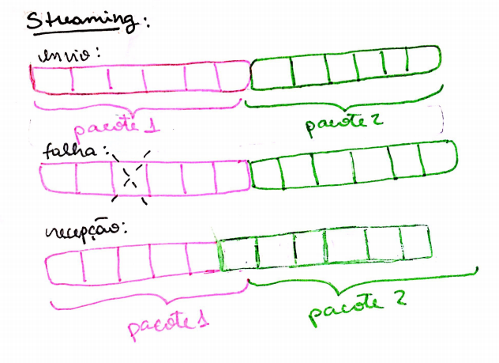
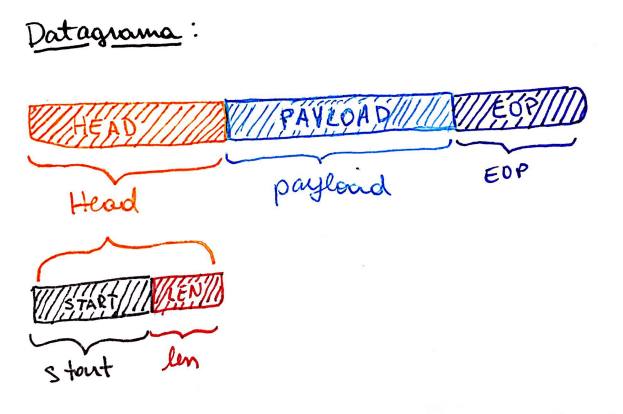
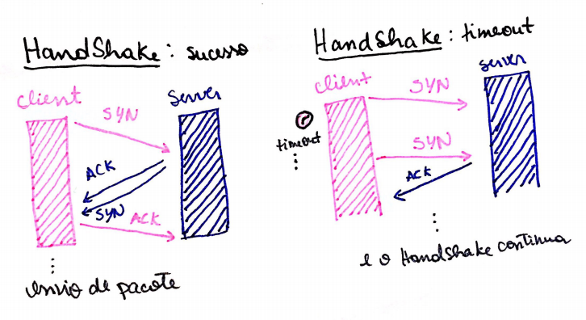
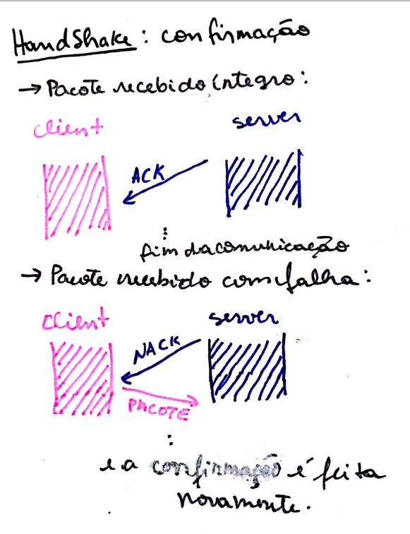

# Projeto 1 : Client - Server 

A documentação desse projeto está no arquivo '1camada.pdf'

# Projeto 2 : Datagrama

## Datagrama

Datagrama é um processo de empacotamento dos dados a serem transmitidos numa comunicação ponto a ponto, para serem detectadas falhas caso ocorram durante a transmissão e/ou recebimento de um dado. É o oposto de streaming de dados.

Quando, em um streaming de dados, um byte é perdido, o receptor ao pegar os dados, pode acabar misturando de forma equivocada bytes do próximo pacote, no pacote atual, já que este possui um byte a menos. Isso faz com que os dados sejam recebidos errados, e sem um mecanismo de detecção dessas falhas, a comunicação/envio dos dados precisaria ser reiniciado muito tempo depois.

Para detectar esse tipo de falha, cria-se um "pacote" com o dado que se deseja enviar, onde há bytes de controle que informam qual o início do pacote, ao tamanho desse pacote, e o fim do mesmo. Assim, ao receber um pacote, o receptor pode conferir se ele começa e termina como deveria, e se esse pacote tem o tamanho que deveria ter. Dessa forma, ambos os pontos tem mais confiança de que o dado recebido é o mesmo que o enviado.

## Implementação

Para essa implementação, foi adicionado um 'HEAD' (cabeçalho) no começo dos dados que se quer enviar (payload). Esse HEAD é composte de um ou mais bytes de início de pacote e o tamanho que esse pacote possui. Ao final desse pacote que já contém Head e payload, é adicionado um EOP (End of packet, ou fim de pacote) para informar que esses são os bytes finais do pacote.

## Comunicação

Uma função chamada Empacota realiza o processo de criar o pacote, adicionando os bytes do HEAD, logo após os dados do que se deseja enviar e por fim o EOP.
Esse pacote é enviado ao receptor e, após ser recebido, para ele ser desempacotado, primeiro uma função chamada HeadPayload encontra o EOP do primeiro pacote no Buffer e o retira, salvando apenas os fragmentos Head + payload em uma variável e atualizando o buffer, já que o primeiro pacote presente nele já foi recuperado. Outra função retira o Head da variável e assim, tem acesso aos dados sozinhos, tendo assim recuperado os dados que se desejava enviar.

 # Projeto 3 : HandShake
 
 Em uma comunicação, falhas podem ocorrer por diversos motivos e em diversas etapas. Como tentativa de diminuir a ocorrência dessas falhas, o HandShake ACK/NACK serve para garantir que tanto o client quanto o server estejam preparados para enviar/receber os dados na comunicação, dessa forma garantindo que o pacote será recebido de forma íntegra. Também serve para confirmar de que o pacote recebido tem as especificações como esperadas, de acordo com os bytes de controle do datagrama.
 
 O HandShake implementado nesse projeto é o 3Way.
 
 ## HandShake 3-Way Ack/Nack
Para se certificar de que o server está preparado para receber o pacote, o client envia um pacote tipo "SYN" ao server, indicando que está pronto para fazer uma sincronia. Nesse momento o client passa a esperar por uma resposta do server. Se o server receber essa solicitação e estiver pronto para estabelecer conexão, ele envia uma resposta positiva "ACK" para o client. Instantes após o envio do "ACK" pelo server, o mesmo envia também um pacote de sincronismo "SYN" para conferir se o client recebeu sua resposta anterior e garantir que ele está preparado para continuar a comunicação e passa a esperar uma resposta "ACK" do client. Se essa resposta do server não for recebida pelo client, existe um tempo limite, o 'timeout', que o client espera por uma resposta, e caso ela não chegue ele reenvia o "SYN". Se a mensagem positiva "ACK" do server for recebida pelo client antes do 'timeout' acabar, ele espera pelo "SYN" do server até ele chegar. Ao receber, ele responde com um "ACK" e, apenas após esse procedimento o pacote pode ser enviado. 

Para garantir o efetivo recebimento do pacote pelo server, um mecanismo que confere os dados recebidos e comunica o sucesso ou falha na recepção deste ao client também foi implementado.
Logo após o envio do pacote de dados, o client passa a esperar uma resposta positiva "ACK" ou negativa "NACK" do server referente ao status do recebimento do pacote. Se o pacote veio nas condições esperadas, o server envia um "ACK" confirmando o sucesso na transmissão e salva os dados. Ao receber esse "ACK", o client finaliza a comunicação. Caso o pacote recebido pelo server estiver corrompido, uma resposta negativa "NACK" é enviada, e ao recebe-la, o client reenvia o pacote e o mesmo é conferido da mesma forma pelo server, após a recepção.

